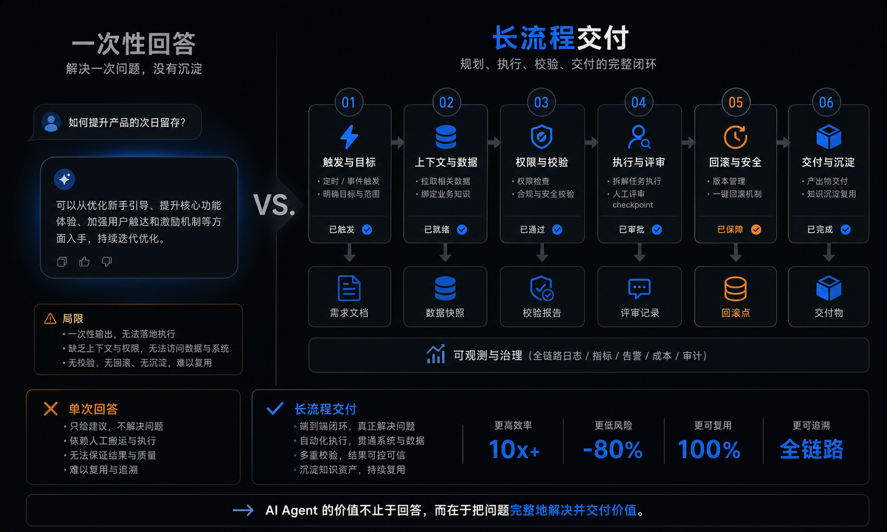
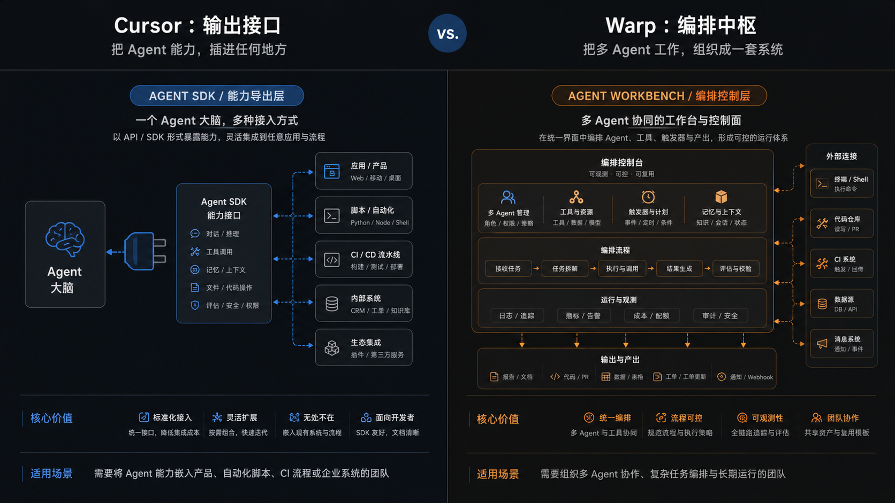
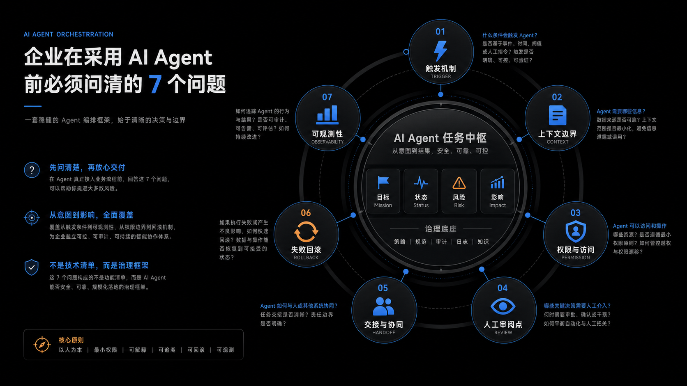
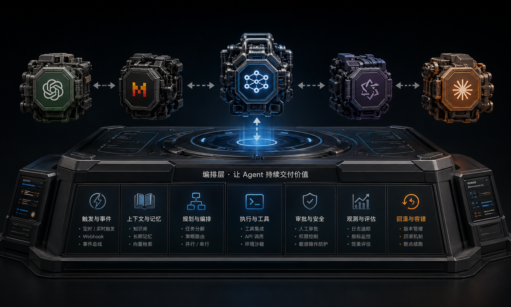

这两天有两个动作，单看都像产品更新。

一个是 Cursor 把 SDK 放出来了。

一个是 Warp 把客户端开源了。

如果只把它们当成两条新闻看，结论会很浅。

真正值得看的，是这两个动作背后指向的是同一件事：

AI Agent 的竞争，正在从“谁更会写”，转向“谁更会组织”。

---

过去一年，大家最喜欢比较的是：

- 哪个模型更聪明
- 哪个 agent 改代码更快
- 哪个产品 demo 更惊艳

但真实工作一旦变长，这些指标就不够了。

因为真正卡住团队的，往往不是第一步生成代码。

而是后面的整条链：

- 任务从哪里触发
- agent 能看到哪些上下文
- 它能调用哪些动作
- 谁来 review
- 中间断了怎么接上
- 出错以后怎么回滚
- 整个过程谁能看见

也就是说，决定 agent 上限的，越来越不是一次回答。

而是一条工作流能不能自己继续往前推。

---

这也是为什么我觉得，Cursor 这次开放 SDK 很关键。

它开放的不是一个聊天框皮肤。

它开放的是一套可以被程序调用的 agent 接口。

官方说得很明确：同一套 agent，既可以跑在本地，也可以跑在 cloud runtime 上；而且带着完整的 harness，包括 codebase indexing、semantic search、MCP、skills、hooks、subagents。

这件事的意义，不是“开发者以后多了一个 npm 包”。

而是 agent 开始从一个产品，变成一个可以嵌进别人的产品、脚本、CI、内部系统里的能力模块。

换句话说，Cursor 在开放 agent 的出口。

---

而 Warp 走的是另一条路。

Warp 最近连续做了三件事：

第一，做 Universal Agent Support，明确说自己要把 Claude Code、Codex、Gemini CLI、OpenCode 这些都接进来。

第二，把 Warp client 开源，而且明确说社区参与的不是传统开源协作，而是一个由 Oz 管理、agent-first 的开发流程。

第三，Oz 文档把平台边界讲得很清楚：CLI、API/SDK、orchestration、environment、observability、trigger、task lifecycle、outputs。

这说明 Warp 想做的，不只是“一个支持 AI 的终端”。

它想做的是 agent 的工作台，甚至是控制平面。

Cursor 更像在说：

“你可以把我的 agent 接进你的系统。”

Warp 更像在说：

“不管你用谁家的 agent，都可以在我的系统里被组织起来。”

一个开放的是能力出口。

一个开放的是运行面。

一个更像 agent SDK。

一个更像 agent OS。

---

这就是今天最值得写的地方。

因为这代表竞争层级变了。

以前比的是：

- 谁能生成更好的代码
- 谁能调出更强的模型
- 谁的 UI 更顺

现在开始比的是：

- 谁能接住长流程
- 谁能容纳多 agent
- 谁能统一本地和云端
- 谁能让人类更容易 review 和接管
- 谁能把 context、permission、audit、artifact 管起来

模型当然还重要。

没有模型能力，后面这些都搭不起来。

但模型正在越来越像发动机。

真正拉开产品差距的，是调度系统，是 review 机制，是回滚能力，是整条链路能不能稳定跑完。

你可以把最强模型接进一个糟糕的 orchestration 里，最后结果还是不停地卡在人机交接、上下文丢失和权限边界上。

你也可以把几个不完全一样的 agent 接进一个更好的 orchestration 里，让它们在不同位置承担不同工作。

---

这也是为什么我越来越觉得，企业接下来选 agent，不该只问：

“你们用的是什么模型？”

更该问的是：

1. 它从哪里接任务？
2. 它拿到的上下文是什么？
3. 它的权限边界怎么设计？
4. 它的 review 在哪一层发生？
5. 中断以后怎么恢复？
6. 过程是否可审计？
7. 输出能不能沉淀成 artifact 和组织记忆？

这 7 个问题，才是真正决定 agent 能不能进入生产环境的问题。

---

说得再直接一点：

最强的 agent，未必能成为最强的平台。

但最强的 orchestration，往往可以持续吸收新的 agent。

因为模型会替换。

单点能力会趋同。

但一家公司如果已经把 trigger、task、memory、permission、review、rollback、observability 都组织成了一套稳定系统，它就不只是一个工具。

它会慢慢变成团队的工作习惯。

而工作习惯，才是更难被替换的东西。

所以我现在更愿意把今天这波变化理解成：

AI Agent 正在从“谁更像天才实习生”，进入“谁更像一个能被组织使用的执行系统”。

下一阶段真正难的，已经不是让 agent 写出第一段代码。

而是让它在一条更长的链路里，持续、可靠、可见、可接管地把活干完。

这才是 Orchestration 的价值。

也是我觉得接下来最值得盯的护城河。

---

## 来源备注

- Cursor SDK in Public Beta
- Warp is now open-source
- Warp Universal Agent Support
- Warp Agent Platform / Oz docs
