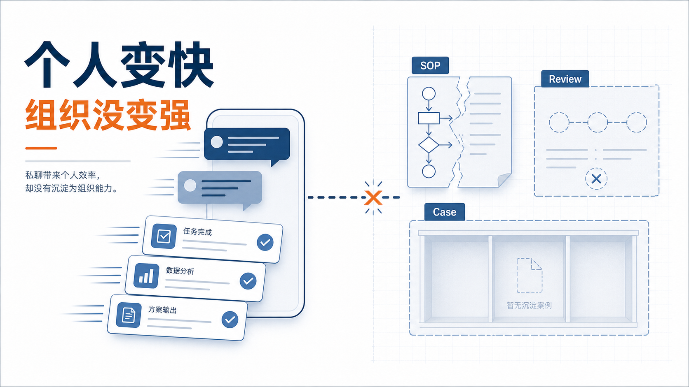
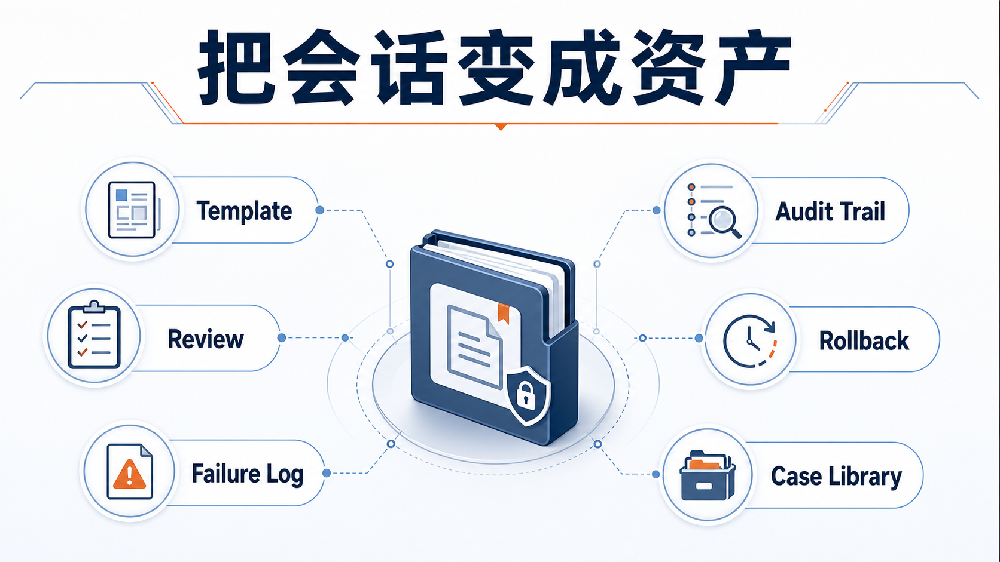
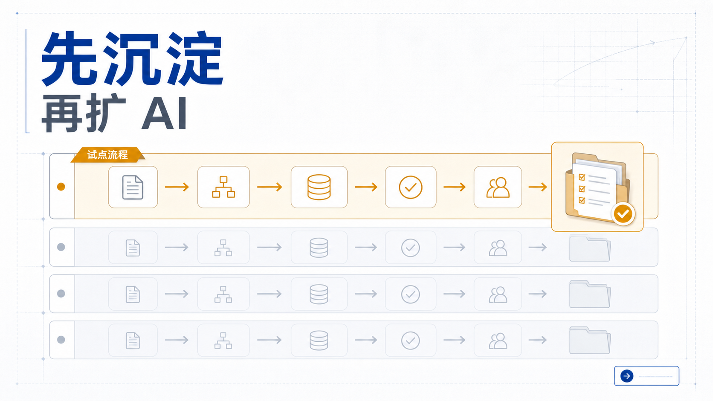

# 企业每个人都有 AI，公司为什么仍然学不会？

现在很多公司最荒谬的地方是：

人人都在用 AI，但公司仍然没有学会任何东西。

这才是我看完今天那篇 HN 高互动文章后，最想写的一句话。

我看到很多团队可能正在进入一个很微妙的阶段：员工确实比去年更会用 AI 了。写方案更快，查资料更快，改代码更快，起草邮件也更快。

但公司并没有同步变聪明。

同样的问题，下周还会再问一遍。同样的错误，下个月还会再犯一遍。同样的 prompt、判断、案例，还是散在每个人的聊天记录里。

所以很多企业以为自己在做 AI 转型，实际上只是把效率外包给了员工的私人会话。

这不是组织升级。

这只是个人外挂。

企业 AI 最大的浪费，从来不是“员工没用 AI”。

而是：每个人都在用 AI，但优秀经验没有进入组织记忆。

这个问题比“模型够不够强”更值得管理者紧张。

因为模型不够强，顶多是这次答案差一点。

但组织没有记忆，意味着公司每天都在重复支付同一笔学费。

今天一个人摸出来的好方法，明天另一个人还要再摸一次。今天一个人踩过的坑，下周别的团队还会再踩一次。

今天 AI 帮你写出的好东西，只要没有进入共享流程、共享模板、共享案例库，它对公司来说就和没发生过差不多。

为什么会这样？

因为聊天框天然只服务“这一次把事做完”。

它不天然服务：下次别人也能做对，主管能 review，风险能审计，出错能回滚，经验能复用。

这也是这篇讨论提醒我的一个常见模式：

表面上，人人都有一个很强的 AI 助手。

实际上，公司没有形成统一的提问框架、共享案例库、明确的 review 节点、失败样本沉淀、可复用 workflow，和可以追责的审计线索。

于是结果就是：

个人越来越熟练，组织仍然越来越健忘。

我觉得很多管理者现在最容易看错的一点是：

他们把“大家都在用 AI”误认为“组织已经学会了 AI”。

这两件事差得非常远。

前者只是工具普及。

后者需要组织层真正长出一套新基础设施：

1. 什么任务适合先交给 AI
2. 什么结果算好结果
3. 哪一步必须人工 review
4. 哪些输出必须转成模板、SOP、checklist
5. 哪些错误必须进入失败库
6. 哪些流程要保留回滚点

如果这些东西没有长出来，你买的不是组织能力。

你买的只是很多分散的个人效率提升。

这也是为什么，企业里最值钱的不是“那个最会写 prompt 的人”。

而是那个能把优秀会话变成共享资产的人。

真正能把 AI 用出 ROI 的公司，最后沉淀的不会是“某个人很会问”。

而会是这些东西：

1. 可复用的任务模板
2. 清楚的 review 标准
3. 高质量的成功案例
4. 同样高价值的失败案例
5. 可追踪的审计链路
6. 出问题能回滚的流程
7. 不断增长的组织记忆

这 7 个东西，才是企业 AI 进入执行层之后真正的护城河。

因为模型会换，工具会换。

但如果一家公司已经把“怎么提问、怎么 review、怎么留痕、怎么复盘、怎么复用”组织成了体系，它以后换模型的成本会越来越低，放大经验的速度会越来越快。

所以管理者接下来最该问的，不该只是：

“你最近有没有多用 AI？”

更该问：

这次好的结果有没有留下来？

它有没有进入团队共享知识库？

它有没有变成别人下次能直接复用的 artifact，也就是可交付的共享资产？

哪一步是 AI 做的，哪一步是人 review 的？

如果今天这个判断错了，团队能不能回滚？

如果下个月再来一次，速度会不会比今天更快？

如果这些问题答不出来，那公司拥有的仍然只是很多零散会话，不是组织记忆。

我越来越觉得，企业 AI 的下一阶段竞争，不只是看谁给员工发了更多 AI 工具。

而是看谁先把这些个人会话，变成共享 workflow、可 review 的 artifact、可审计的决策链、可回滚的流程节点、可复用的组织记忆。

每个人都有 AI，不代表公司学会了什么。

只有当优秀经验离开个人会话，进入组织记忆，AI 才开始真正为公司复利。
