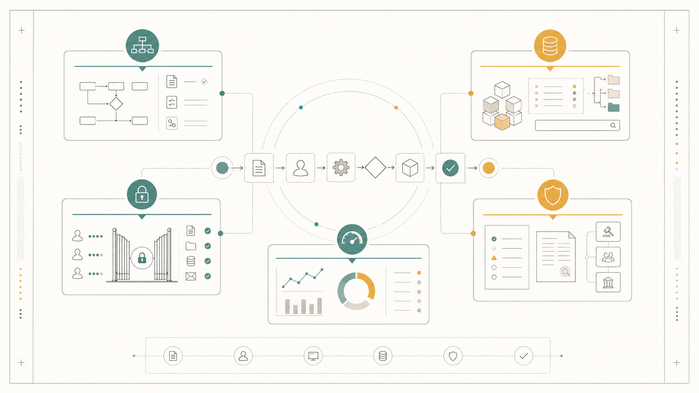
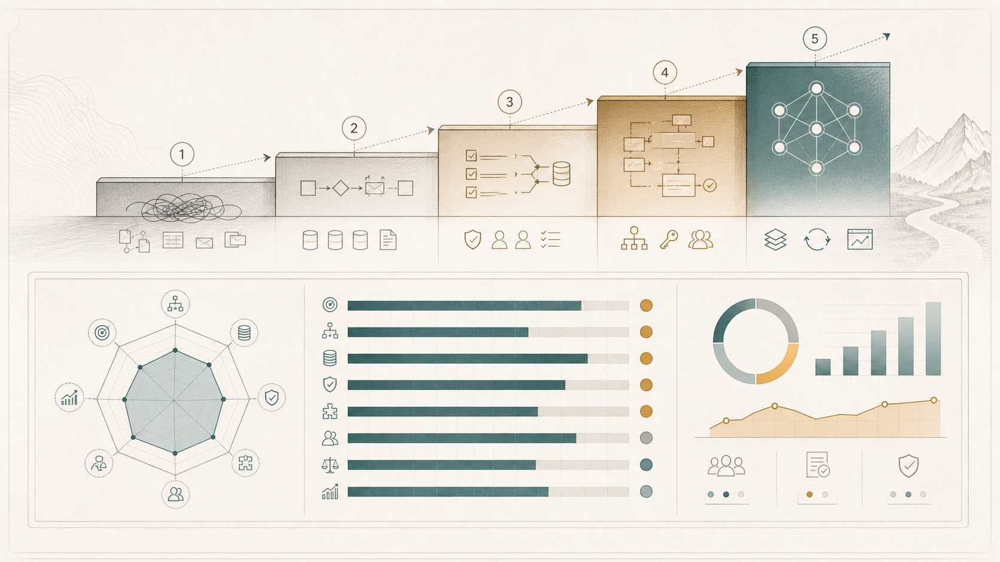
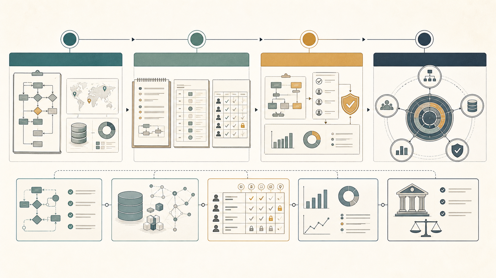

# 企业导入 AI，第一步不是买模型，而是重构管理系统

很多企业导入 AI 的顺序是反的。

它们先问模型、知识库、Copilot、数字员工。

但第一问应该是：

> 我们公司有没有一部分工作流程，已经清楚到可以被 AI 接管？

我对 AI Ready 的定义是：

> AI Ready = 企业的工作流程可被描述，数据可被检索，权限可被控制，结果可被评估，风险可被治理。

企业能不能导入 AI，不是看它有没有买模型、有没有知识库、有没有上 Copilot，而是看组织、流程、数据、权限、评估，是否已经能让 AI 安全接手一部分工作。

模型并不弱，工具也不少。真正弱的是模型外面那套管理系统。

## 不要先建全公司数据中台，先选 1-3 个高价值流程

我不建议企业一上来就做“全公司 AI 改造工程”。

这听起来正确，但现实里很容易变成大项目、长周期、低反馈。

更好的起点，是先选 1-3 个高价值流程：

- 客服工单分流和回复草拟。
- 销售线索整理和跟进提醒。
- 合同摘要、风险条款标记和审批流转。
- 项目周报、交付风险、客户反馈汇总。
- 财务报销、采购比价、库存预警。

这些流程有共同点：数据依赖强，重复性高，有明确输入输出，有人类复核空间，做错以后也能回滚。

企业先把这些流程所需的数据、SOP、权限、评价标准结构化，再逐步扩张成企业级 Agent OS。

不是先把全公司的数据都整理完，才开始导入 AI。

而是从一个具体流程开始，让企业学会怎么把工作改造成 AI 可理解、可执行、可治理的形态。

## 判断企业是否准备好导入 AI，看 8 个维度

我建议用一个 100 分评分表做诊断。

这 100 分可以拆成 8 个模块：

- 战略清晰度，15 分：是否有明确 AI 场景、ROI、优先级、负责人。
- 流程标准化，15 分：是否有 SOP、流程图、异常处理、审批机制。
- 数据可用性，20 分：数据是否集中、结构化、可检索、可追溯。
- 权限与安全，15 分：是否有数据分级、访问控制、审计、脱敏。
- 系统连接能力，10 分：CRM、ERP、邮件、工单、财务系统是否可 API 化。
- 组织接受度，10 分：管理层是否支持，中层是否配合，员工是否愿意使用。
- AI 治理能力，10 分：是否有 AI 使用规范、风险分级、人工复核。
- 评估与迭代能力，5 分：是否能衡量 AI 产出质量并持续改进。

分数不是为了好看，是为了决定企业现在能做什么。

- 0-30 分：先做培训、使用规范、个人效率工具。
- 31-50 分：可以做部门级 AI 助手。
- 51-70 分：可以做流程型 Agent。
- 71-85 分：可以做跨部门数字员工。
- 86 分以上：可以建设企业级 Agent OS。

很多企业的问题不是“不能用 AI”。

而是它明明只有 40 分，却想直接做 85 分的东西。

## 管理模式没准备好，AI 只能变成高级聊天窗口

过去没有 AI 的时候，很多公司靠人脑、微信群、Excel、老员工经验、老板拍板来运转。

这个系统人能忍，AI 不能忍。

人可以猜老板意思，可以私下问同事，可以凭经验补齐上下文。AI 不行。它需要边界、输入、输出、规则、权限、评价标准。

一个 AI 数字员工至少需要 5 件事：

1. 清楚的任务边界。
2. 明确的输入输出。
3. 标准操作流程。
4. 决策权限。
5. 评价标准。

没有这些，企业买到的不是数字员工，而是一个高级聊天窗口。

它能回答问题，但不能稳定交付。

它能生成内容，但不能进入流程。

它能让个人变快，但不能让组织变强。

## 数据准备不是“有没有数据”，而是“AI 能不能用”

企业常说：“我们有很多数据。”

但 AI 真正需要问的是：数据在哪里？谁负责？字段统一吗？权限清楚吗？质量稳定吗？语义能被理解吗？

我建议用 6 个问题判断数据是否 AI Ready：

- 数据位置：数据在哪里？AI Ready 的状态是有数据地图 / 数据目录。
- 数据归属：谁负责？AI Ready 的状态是每类数据有 owner。
- 数据结构：AI 看得懂吗？AI Ready 的状态是有标准字段、标签、元数据。
- 数据权限：谁能看？AI Ready 的状态是 RBAC / ABAC / 分级授权。
- 数据质量：准不准？AI Ready 的状态是有质量检测和更新机制。
- 数据语义：知道含义吗？AI Ready 的状态是有业务 ontology / 数据字典。

这里最容易被忽略的是语义。

知识库只能让 AI 搜到文件。

语义层才能让 AI 理解关系：客户、产品、合同、订单、交付、审批、风险之间如何连接。

没有语义层，AI 只能像一个检索员。

有了语义层，AI 才有机会变成流程参与者。

## 企业真正需要的不是知识库，而是可操作系统

很多公司第一反应是：“那我们建个知识库吧。”

知识库有价值，但只是第一层。

真正能支撑数字员工的企业系统，至少有 5 层：

- 知识层：知道公司有什么资料。
- 语义层：知道资料之间的关系。
- 工具层：能调用 CRM、ERP、飞书、企微、邮件、工单、财务、库存、合同系统。
- 权限层：知道自己能做什么，哪些动作必须审批。
- 评估层：做完之后能被检查，包括日志、审计、复核、错误率、响应时长、用户满意度。

这 5 层加起来，才接近企业级 Agent OS。

## 最关键的问题：这个流程能不能被 AI 接管一部分？

如果只问“公司能不能导入 AI”，问题太大。

更好的问法是：

> 这个具体流程，有没有一段可以被 AI 接管？

你可以拿 10 个问题去问客户：

1. 最核心的 10 个业务流程有没有流程图？
2. 每个流程的输入、输出、负责人是否清楚？
3. 关键数据在哪里？谁负责维护？
4. 同一个客户、订单、合同、产品有没有唯一 ID？
5. 员工离职后，经验是否还留在系统里？
6. 审批规则是写在制度里，还是只存在主管脑子里？
7. 数据权限有没有分级？
8. 有没有 API 或系统连接能力？
9. AI 做错时，谁负责复核和纠正？
10. 有没有衡量 AI 效果的指标？

如果这些问题答不上来，企业不是不能导入 AI。

它只是还不适合直接买“数字员工”。

它应该先做 AI Readiness 整备项目。

## 企业 AI 服务的切入点：从卖 Agent，升级成三阶段交付

如果你是做企业 AI 服务的，我建议不要只说“我们帮你做 AI Agent”。

这句话太像工具交付。

更高级的切入点是：

> 我们帮你把企业改造成 AI 可理解、可执行、可治理的组织系统。

可以设计成三阶段：

Phase 1：AI Readiness Assessment，AI 导入成熟度诊断。

交付物：成熟度评分、业务流程盘点、数据资产地图、use case 优先级矩阵、风险与权限初评、90 天试点路线图。

Phase 2：Data & Workflow Restructuring，数据与流程重整。

交付物：核心流程 SOP 化、数据字典、权限矩阵、知识库 / RAG 架构、业务 ontology 初版、系统连接方案。

Phase 3：Digital Employee Pilot，数字员工试点。

交付物：1-3 个 Agent 原型、人工审批机制、操作日志、效果评估仪表板、迭代计划、扩展方案。

这比单纯卖工具更像一个真正的企业改造项目。

## 最后的判断公式

我会这样总结：

> AI 导入成功率 = 场景清晰度 x 数据可用性 x 流程标准化 x 权限治理 x 组织执行力。

其中任何一项接近 0，整体结果都会接近 0。

所以企业导入 AI 之前，真正要做的不是追模型发布会。

而是完成一次 AI-ready 的管理系统与数据系统重构：

让业务流程可被描述。
让数据资产可被理解。
让权限边界可被控制。
让 AI 的每一次行动可被追踪和评估。

数字员工不是从 prompt 里长出来的。

它是从一个足够清楚、足够可控、足够可复盘的组织系统里长出来的。

## 参考

- Microsoft Learn, Create your AI strategy: https://learn.microsoft.com/en-us/azure/cloud-adoption-framework/strategy/responsible-ai
- NIST AI RMF Core: https://airc.nist.gov/airmf-resources/airmf/5-sec-core/
- Google Cloud, Generative AI and zero data retention: https://cloud.google.com/vertex-ai/generative-ai/docs/data-governance?authuser=0
- ISO/IEC 42001:2023: https://www.iso.org/standard/42001
